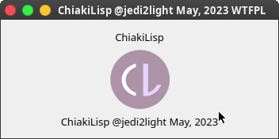

# ChiakiLisp - Yet another LISP

## Demo

[Qt5 Demo Source Code](examples/fujisaki-example.cl)

## Libraries

All the libraries are written in pure ChiakiLisp and located in the [`libraries`](./libraries) directory.

1. [Fujisaki](libraries/fujisaki.cl) - a small library that allows to write PyQt5 applications in a declarative way.

## Description

[ChiakiLisp](https://chiakilisp.jedi2light.moe) - Yet another LISP

There are few similar projects:
 - [HyLang](https://hylang.org) - compiles LISP into Python 3 bytecode, then interprets

## License and contribution

This project is licensed under WTFPL license, that means that you can **do whatever you want with this precious thing**
