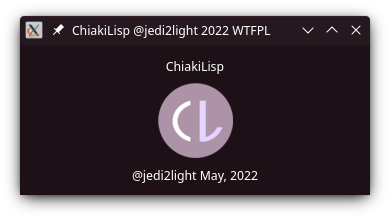

# ChiakiLisp, LISP syntax over Python && C++

## Qt5 Demo

## Demo Source

1. [AST Evaluate Mode (Python3 API)](examples/ast-mode/qt5-simple-app-window.cl)
2. [Code Generation' Mode (C++ API)](examples/cxx-mode/qt5-simple-app-window.cl)

## Other Demos

### There examples support ast-mode/cxx-mode

1. [Recursively Calculated Factorial](examples/factorial.cl)
2. [A short example for a Functional Programming Style](./examples/funcional.cl)

## Description

[ChiakiLisp](https://chiakilisp.jedi2light.moe) - yet another LISP syntax for the Python 3 && C++

There are few similar projects already exist:
 - [HyLang](https://hylang.org) - pretty cool project, compiles LISP into Python 3 bytecode, cool
 - [NanamiLang](https://nanamilang.jedi2light.moe) - my attempt to mix Clojure-like look-and-feel and Python 3 core

## Simple and complex (collections) data types

ChiakiLisp does not use custom wrappers for any of them:
 - When you type `nil`, you get `NoneType` data type, `NULL` in C++
 - When you type `1234`, you get `int` data type, `long` in C++
 - When you type `"hello, world"`, you get `str` data type, `char*` in C++
 - When you type `true` or `false`, you get `bool` data type, `bool` in C++
 - When you type `[...]`, you get `list` data type, `std::vector<T>` in C++
 - When you type `{...}`, you get `dict` data type, not implemented for C++

## License and contribution

This project is licensed under WTFPL license, that means that you can **do whatever you want with this shitty thing**